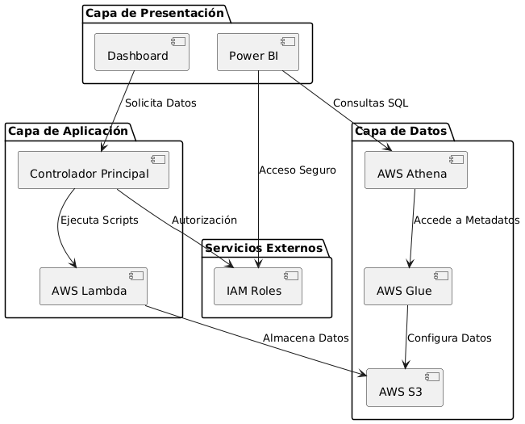

# UNIVERSIDAD PRIVADA DE TACNA  
## FACULTAD DE INGENIERÍA  
### Escuela Profesional de Ingeniería de Sistemas

**Sistema de Monitoreo y Gestión de Red para Laboratorios UPT (SIMGR-UPT)**

Curso: *Inteligencia de Negocios*  
Docente: *Mag. Patrick Cuadros Quiroga*

**Integrantes:**

- Escobar Rejas, Carlos Andrés (2021070016)
- Apaza Ccalle, Albert Kenyi (2021071075)
- Cutipa Gutierrez, Ricardo (2021069827)
- Churacutipa Blass, Erick (2020067578)
- Huallpa Maron, Jesús Antonio (2021071085)

**Tacna – Perú**  
***2024***

---

# Sistema de Monitoreo y Gestión de Red para Laboratorios UPT (SIMGR-UPT)*

**Documento de Especificación de Requerimientos de Software**

Versión *{1.0}*

---

## CONTROL DE VERSIONES

| Versión | Hecha por | Revisada por | Aprobada por | Fecha      | Motivo           |
| :-----: | --------- | ------------ | ------------ | ---------- | ---------------- |
| 1.0     | CER       | RDCG          | AAC         | 18/11/2024 | Versión Original |
---

# INDICE GENERAL

1. **INTRODUCCIÓN**
   - 1.1. Propósito (Diagrama 4+1)
   - 1.2. Alcance
   - 1.3. Definición, siglas y abreviaturas
   - 1.4. Organización del documento
2. **OBJETIVOS Y RESTRICCIONES ARQUITECTÓNICAS**
   - 2.1. Requerimientos Funcionales
   - 2.2. Requerimientos No Funcionales – Atributos de Calidad
3. **REPRESENTACIÓN DE LA ARQUITECTURA DEL SISTEMA**
   - 3.1. Vista de Caso de uso
     - 3.1.1. Diagramas de Casos de uso
   - 3.2. Vista Lógica
     - 3.2.1. Diagrama de Subsistemas (paquetes)
     - 3.2.2. Diagrama de Secuencia (vista de diseño)
     - 3.2.3. Diagrama de Colaboración (vista de diseño)
     - 3.2.4. Diagrama de Objetos
     - 3.2.5. Diagrama de Clases
     - 3.2.6. Diagrama de Base de datos (relacional o no relacional)
   - 3.3. Vista de Implementación (vista de desarrollo)
     - 3.3.1. Diagrama de arquitectura software (paquetes)
     - 3.3.2. Diagrama de arquitectura del sistema (Diagrama de componentes)
   - 3.4. Vista de procesos
     - 3.4.1. Diagrama de Procesos del sistema (diagrama de actividad)
   - 3.5. Vista de Despliegue (vista física)
     - 3.5.1. Diagrama de despliegue
4. **ATRIBUTOS DE CALIDAD DEL SOFTWARE**
   - Escenario de Funcionalidad
   - Escenario de Usabilidad
   - Escenario de Confiabilidad
   - Escenario de Rendimiento
   - Escenario de Mantenibilidad
   - Otros Escenarios

---

# INTRODUCCIÓN

### 1.1 Propósito (Diagrama 4+1)

Con la incorporación de nuevas tecnologías y servicios, el propósito del sistema SIMGR-UPT evoluciona para incluir capacidades de procesamiento y análisis de datos basadas en la nube. Estas adiciones permiten:

Automatización del flujo de datos: Desde la extracción de datos hasta la generación de reportes listos para análisis en Power BI.
Escalabilidad en el procesamiento: Uso de servicios como AWS Lambda y Athena para manejar grandes volúmenes de datos de red sin afectar el rendimiento.
Integración continua: La incorporación de AWS IAM Roles, Lambda y S3 garantiza la interoperabilidad entre los servicios, mientras que Power BI permite una visualización interactiva y dinámica de los datos.
El nuevo flujo incluye:

 - Repositorio (IAM Role): Los archivos CSV se almacenan en un repositorio.
 - Procesamiento (Lambda): Los scripts en Python se ejecutan automáticamente en AWS Lambda para procesar los datos.
 - Almacenamiento (S3 Bucket): Los datos procesados se almacenan en un bucket S3.
 - Configuración (Glue Crawler): AWS Glue configura automáticamente los datos recibidos y genera tablas de metadatos.
 - Consulta (Athena): Las tablas se consultan mediante SQL en Athena.
 - Visualización (Power BI): Los resultados procesados se integran con Power BI para una visualización avanzada y generación de informes.
   
Estas mejoras refuerzan la funcionalidad del sistema y lo alinean con estándares modernos de arquitectura de datos, asegurando un flujo continuo desde la recopilación hasta el análisis.

### 1.2 Alcance
El sistema ahora incluye los siguientes componentes clave:

Repositorio inicial: Recepción de datos en formato CSV desde distintas fuentes.
AWS Lambda: Ejecución automatizada de scripts en Python para procesar los datos de red.
AWS S3 y Glue: Almacenamiento y configuración automática de los datos, generando tablas para consulta y análisis.
AWS Athena: Plataforma de consulta para procesar los datos mediante SQL y generar métricas clave.
Power BI: Visualización avanzada e interactiva de los datos en tiempo real.
El alcance sigue centrado en el análisis del desempeño de la red en los laboratorios, pero ahora abarca:

Automatización del flujo de datos en la nube.
Mayor capacidad para manejar volúmenes crecientes de datos y nuevos requisitos.
Se omiten vistas o componentes que no estén alineados con este enfoque, como integraciones directas con hardware físico o desarrollo de aplicaciones móviles.

### 1.3 Definición, siglas y abreviaturas

|  Término/Acrónimo  | Definición                                                                                  |
| :-----------------: | :------------------------------------------------------------------------------------------ |
| IAM Role           | Rol de identidad y acceso en AWS que otorga permisos para interactuar con recursos en la nube. |
| Lambda             | Servicio sin servidor de AWS que ejecuta scripts en respuesta a eventos.                    |
| S3 Bucket          | Servicio de almacenamiento en la nube de AWS utilizado para guardar y recuperar datos.      |
| Glue Crawler       | Herramienta de AWS Glue que escanea datos y genera automáticamente metadatos para su análisis. |
| Athena             | Servicio de consultas SQL sin servidor en AWS que permite explorar datos almacenados en S3. |
| Power BI           | Herramienta de Microsoft para la visualización interactiva y generación de informes.         |
| CSV                | Formato de archivo que almacena datos tabulares separados por comas.                        |

### 1.4 Organización del documento

El documento incluye ahora los nuevos flujos y tecnologías integrados en el sistema, con la siguiente estructura:

- INTRODUCCIÓN: Contexto del proyecto, propósito, alcance y definiciones clave.
- OBJETIVOS Y RESTRICCIONES ARQUITECTÓNICAS: Actualizado para incluir los nuevos servicios y tecnologías implementados.
- REPRESENTACIÓN DE LA ARQUITECTURA DEL SISTEMA: Diagramas UML actualizados, como diagramas de flujo de datos, vistas lógicas, de procesos y físicas.
- ATRIBUTOS DE CALIDAD DEL SOFTWARE: Evaluación del impacto de las nuevas tecnologías en la funcionalidad, confiabilidad y rendimiento.
- CONCLUSIONES Y RECOMENDACIONES: Beneficios de la integración con AWS y sugerencias para futuras mejoras.

---

# OBJETIVOS Y RESTRICCIONES ARQUITECTÓNICAS

### 2.1 Requerimientos Funcionales

|  ID   | Descripción                                                                                           | Prioridad |
| :---: | :---------------------------------------------------------------------------------------------------- | :-------: |
| RF-01 | Monitorear en tiempo real el uso del tráfico de red de los equipos. |   Alta    |
| RF-02 | Generar reportes detallados y personalizables sobre el rendimiento de los equipos y patrones de uso.   |   Alta    |
| RF-03 | Detectar, notificar y registrar anomalías en el rendimiento de los recursos tecnológicos.              |   Alta    |
| RF-04 | Exportar datos en formatos compatibles con Tableau (CSV, Excel) y JSON.                               |   Alta    |
| RF-05 | Almacenar datos históricos para análisis a largo plazo y comparativas de rendimiento.                  |   Alta    |
| RF-06 | Proporcionar un panel de control interactivo para visualizar datos clave en tiempo real.               |   Alta    |
| RF-07 | Permitir la integración con otros sistemas de gestión de la universidad mediante API REST.             |  Media    |

### 2.2 Requerimientos No Funcionales – Atributos de Calidad

|  ID   | Descripción                                                                                   | Prioridad |
| :---: | :-------------------------------------------------------------------------------------------- | :-------: |
| RNF-01 | El sistema debe ser compatible con sistemas operativos Windows y distribuciones de Linux.     |   Alta    |
| RNF-02 | La interfaz debe ser intuitiva y accesible desde navegadores web modernos.                    |   Alta    |
| RNF-03 | Los datos recolectados deben estar protegidos mediante protocolos de seguridad.  |   Alta    |
| RNF-04 | La solución debe ser escalable para nuevos laboratorios sin comprometer el rendimiento.       |   Alta    |
| RNF-05 | El tiempo de respuesta para operaciones críticas debe ser menor a 2 segundos.                 |   Alta    |
| RNF-06 | El almacenamiento debe incluir respaldo automático y procedimientos de recuperación ante fallos. |   Alta    |
| RNF-07 | El consumo de recursos del sistema debe ser mínimo para no afectar el rendimiento de los equipos monitorizados. |  Media    |

### 2.3 Restricciones

### **Restricciones Tecnológicas**
- El sistema debe ser implementado utilizando servicios de AWS, como Lambda, S3, Glue, y Athena, para el procesamiento y almacenamiento de datos.
- El script de monitoreo debe desarrollarse en Python y ejecutarse en un entorno sin servidor (AWS Lambda).
- Las métricas y reportes generados deben ser compatibles con herramientas de visualización como Power BI y Tableau.
- El sistema debe ser compatible únicamente con sistemas operativos Windows y distribuciones de Linux en los laboratorios de la universidad.

### **Restricciones de Infraestructura**
- El almacenamiento de datos debe estar centralizado en un bucket S3 de AWS y seguir las políticas de gestión de datos definidas por la UPT.
- Las computadoras de los laboratorios deben tener conectividad constante con la red universitaria para garantizar la recolección continua de datos.
- La infraestructura de red existente en los laboratorios debe soportar el flujo de datos requerido para la recolección y transmisión hacia AWS.

### **Restricciones de Seguridad**
- El acceso al sistema debe estar limitado a personal autorizado, utilizando autenticación basada en IAM Roles de AWS.
- Los datos recolectados y procesados deben cumplir con la Ley de Protección de Datos Personales de Perú (Ley N° 29733).
- Todas las transmisiones de datos entre los componentes del sistema deben estar cifradas mediante HTTPS y TLS.

### **Restricciones Financieras**
- El presupuesto asignado debe contemplar el uso de servicios en la nube de AWS bajo el modelo de pago por uso, evitando costos innecesarios.
- No se debe adquirir infraestructura física adicional; el proyecto debe operar completamente sobre soluciones en la nube.

### **Restricciones de Tiempo**
- La implementación inicial del sistema debe completarse en un período de seis meses, incluyendo el desarrollo, pruebas y despliegue.
- Las fases de pruebas deben garantizar un tiempo máximo de inactividad de los servicios menor al 5% del tiempo total del proyecto.

### **Restricciones Operativas**
- El sistema debe operar sin interrupciones en horarios laborales (de 8:00 AM a 8:00 PM), con disponibilidad mínima del 95%.
- El panel de control y reportes deben estar disponibles en tiempo real con un tiempo de respuesta no mayor a 2 segundos para consultas críticas.

### **Restricciones de Escalabilidad**
- El sistema debe ser capaz de integrar nuevos laboratorios o áreas sin necesidad de rediseñar la arquitectura base.
- El flujo de datos debe manejar un crecimiento del 50% en el volumen de métricas recolectadas durante los próximos dos años.

---

# REPRESENTACIÓN DE LA ARQUITECTURA DEL SISTEMA

### 3.1 Vista de Caso de uso

La vista de caso de uso describe las principales funcionalidades del sistema desde la perspectiva de los actores involucrados y las interacciones con el sistema. Estos casos de uso representan el núcleo funcional del sistema **SIMGR-UPT (Sistema de Monitoreo y Gestión de Red de la UPT)**.

### **Actores**
1. **Técnico de Soporte:**
   - Responsable del monitoreo en tiempo real de las métricas de red.
   - Detecta y soluciona problemas de conectividad utilizando las alertas generadas por el sistema.
   - Genera reportes personalizados para analizar tendencias y patrones de uso.

2. **Administrador del Sistema:**
   - Configura y administra el sistema, incluyendo usuarios, permisos y parámetros operativos.
   - Supervisa el almacenamiento de datos históricos y la integración con otros sistemas.
   - Utiliza reportes analíticos para planificar mejoras y estrategias de mantenimiento.

3. **Estudiante/Usuario Final:**
   - Beneficiario indirecto de un sistema de red optimizado.
   - Reporta problemas de conectividad al técnico de soporte.

### **Casos de Uso Principales**
1. **CU01: Monitorear Estado de la Red**
   - **Descripción:** El técnico de soporte accede al sistema para monitorear en tiempo real las métricas de red, como velocidad, uso de ancho de banda y conexiones activas.
   - **Flujo Principal:**
     1. El técnico inicia sesión en el sistema.
     2. Accede al dashboard para visualizar métricas de red en tiempo real.
     3. Identifica posibles problemas mediante alertas visuales.
     4. Realiza acciones correctivas según sea necesario.
   - **Actor Principal:** Técnico de Soporte.
   - **Precondición:** El sistema debe estar operativo, y las métricas de red deben ser accesibles.

2. **CU02: Generar Reportes de Uso**
   - **Descripción:** Permite al técnico o administrador generar reportes detallados sobre el desempeño de la red.
   - **Flujo Principal:**
     1. El usuario selecciona el rango de fechas y las métricas deseadas.
     2. El sistema procesa los datos y genera un informe personalizado.
     3. El usuario descarga el informe en formato CSV o Excel.
   - **Actor Principal:** Técnico de Soporte, Administrador del Sistema.
   - **Precondición:** Los datos históricos deben estar almacenados y organizados.

3. **CU03: Configurar Dashboard**
   - **Descripción:** El administrador personaliza el dashboard seleccionando las métricas y visualizaciones a mostrar.
   - **Flujo Principal:**
     1. El administrador accede a la configuración del dashboard.
     2. Selecciona y organiza los widgets y gráficos.
     3. Guarda los cambios y visualiza una vista previa.
   - **Actor Principal:** Administrador del Sistema.
   - **Precondición:** El administrador debe tener permisos suficientes para realizar cambios en el sistema.

4. **CU04: Exportar Datos**
   - **Descripción:** Permite exportar datos procesados a formatos estándar para integrarlos con otras herramientas, como Power BI.
   - **Flujo Principal:**
     1. El usuario selecciona los datos y el formato de exportación (CSV, JSON, Excel).
     2. El sistema genera el archivo y lo descarga en el dispositivo.
   - **Actor Principal:** Técnico de Soporte, Administrador del Sistema.
   - **Precondición:** Los datos deben estar disponibles en el sistema.

#### 3.1.1 Diagramas de Casos de uso

El siguiente diagrama muestra una visión global de las interacciones entre los actores principales (Técnico de Soporte, Administrador del Sistema y Estudiante) y las funcionalidades clave del sistema **SIMGR-UPT**:

#### **Descripción de los Escenarios**
1. **Monitorear Estado de la Red (CU01):**
   - **Actor Principal:** Técnico de Soporte.
   - **Descripción:** Permite supervisar en tiempo real las métricas de red y recibir alertas sobre posibles problemas.
   - **Relaciones:** Incluye casos de uso secundarios, como detección de anomalías y generación de alertas automáticas.

2. **Generar Reportes de Uso (CU02):**
   - **Actor Principal:** Técnico de Soporte, Administrador del Sistema.
   - **Descripción:** Generación de informes detallados sobre métricas de red y patrones históricos para análisis posterior.
   - **Relaciones:** Extiende la funcionalidad del monitoreo con la opción de analizar datos históricos.

3. **Configurar Dashboard (CU03):**
   - **Actor Principal:** Administrador del Sistema.
   - **Descripción:** Permite personalizar la visualización del sistema seleccionando métricas clave y gráficos relevantes.
   - **Relaciones:** Relacionado con la vista y manipulación de datos del sistema.

4. **Exportar Datos (CU04):**
   - **Actor Principal:** Técnico de Soporte, Administrador del Sistema.
   - **Descripción:** Permite exportar los datos en formatos como CSV, Excel o JSON para análisis externo.
   - **Relaciones:** Complementa los reportes y análisis con opciones de integración con otras herramientas.

---

### 3.2 Vista Lógica

El siguiente diagrama de paquetes muestra los límites del sistema, organizando los componentes principales y las entidades que interactúan con él:

### **Descripción**
1. **Capa de Presentación:**
   - Contiene la interfaz del usuario, como el dashboard interactivo para monitorear métricas y generar reportes.
   - Incluye la integración con Power BI para la visualización de datos.

2. **Capa de Aplicación:**
   - Gestiona la lógica de negocio y las interacciones entre los usuarios y el sistema.
   - Procesa solicitudes para monitorear métricas y ejecutar scripts.

3. **Capa de Datos:**
   - Responsable del almacenamiento y manejo de datos históricos en AWS S3.
   - Incluye Glue y Athena para la configuración y consulta de datos.

4. **Servicios Externos:**
   - AWS Lambda para ejecutar scripts en Python.
   - IAM Roles para gestionar permisos y accesos.

#### 3.2.1 Diagrama de Subsistemas (paquetes)

El diagrama de subsistemas ilustra los límites del sistema **SIMGR-UPT** y las entidades internas y externas que interactúan con él. Esta vista ayuda a delimitar claramente las responsabilidades de cada componente y su interacción con los servicios externos.

---

## **Descripción del Diagrama**

1. **Límite del Sistema:**
   - El sistema está compuesto por tres capas principales:
     - **Capa de Presentación:** Interfaz de usuario que incluye el dashboard y Power BI para visualización de datos.
     - **Capa de Aplicación:** Gestión de la lógica del negocio y coordinación de operaciones mediante AWS Lambda.
     - **Capa de Datos:** Manejo de datos utilizando S3 para almacenamiento, Glue para configuración y Athena para consultas.

2. **Interacción con Entidades Externas:**
   - **Servicios Externos (IAM Roles):** Autorizan el acceso seguro entre los componentes del sistema.
   - **Usuarios Finales:** Técnicos, administradores y herramientas de análisis interactúan con el sistema mediante Power BI y el dashboard.

3. **Componentes Principales:**
   - **Dashboard:** Proporciona un punto de acceso para usuarios finales.
   - **AWS Lambda:** Ejecuta scripts para procesar los datos recibidos.

#### 3.2.2 - 3.2.6 Otros diagramas
[Incluir diagramas de secuencia, colaboración, objetos, clases y base de datos.]

### 3.3 Vista de Implementación (vista de desarrollo)
[Mapa de los subsistemas, paquetes y clases de la Vista Lógica.]

#### 3.3.1 Diagrama de arquitectura software (paquetes)
[Descripción de la arquitectura del sistema, distribución y funciones.]

### 3.4 Vista de procesos
[Descomposición del sistema en procesos pesados y su interacción.]

#### 3.4.1 Diagrama de Procesos del sistema
[Diagrama mostrando actividades del sistema propuesto.]

### 3.5 Vista de Despliegue (vista física)
[Escenarios de distribución física del sistema y comunicación entre nodos.]

#### 3.5.1 Diagrama de despliegue
[Diagrama de despliegue mostrando contenedores del sistema.]

---

# ATRIBUTOS DE CALIDAD DEL SOFTWARE

### Escenario de Funcionalidad
[Evaluación de características y capacidades del sistema.]

### Escenario de Usabilidad
[Facilidad de uso y aprendizaje del sistema.]

### Escenario de Confiabilidad
[Confidencialidad, integridad y disponibilidad de los datos del sistema.]

### Escenario de Rendimiento
[Velocidad de procesamiento y uso de recursos.]

### Escenario de Mantenibilidad
[Extensibilidad, adaptabilidad y servicialidad del sistema.]

### Otros Escenarios
[Otros atributos de calidad, como rendimiento o performance.]

